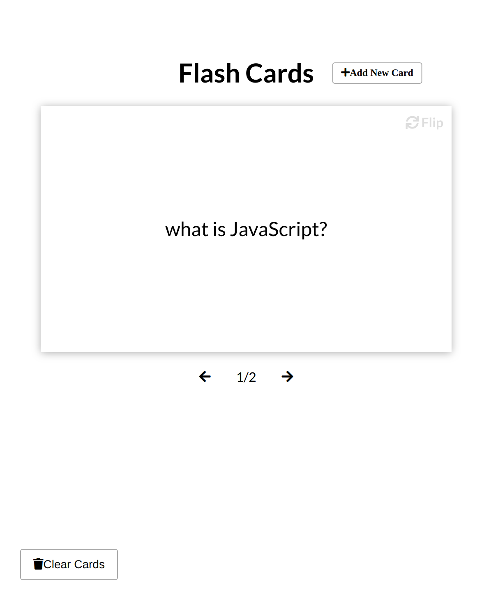

# flash-card

A simple Flash Card app, built using vanilla JavaScript

### Functions:

[The app](https://tn-space.github.io/speech-text-reader/)

The app has many typical functions:

- user can add new card into local storage
- flip between front and back of a card
- show the position of the current card compared to the deck
- the clear button can clear all cards in local storage

### Images:

